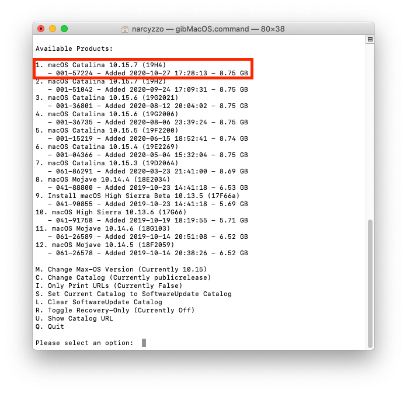

## Pobieranie instalatora z gibMacOS

 * *Narzędzie to pozwoli Ci pobrać kopię MacOS w wersji od 10.13.x do najnowszej* 

Jeśli jesteś na maszynie spełniającej wymagania systemu który chcesz pobrać, mozesz uzyć App store do pobrania instalatora.

Pobierz narzedzie [gibMacOS](https://github.com/corpnewt/gibMacOS), nastepnie rozpakuj, przejdz do folderu i odpal `gibMacOS.command`:

Pojawią sie wersje MacOS z katalogu publicznego, jeśli chcesz pobrac wersje beta zmień katalog : `C.Change Catalog`

* Kopia instalatora bedzie pobrana do katalogu `gibMacOS-master/macOS Downloads`
* Aby przekonwertować pobrane pliki do `.app` i przenieść instalator do folderu /Applications uruchom `InstallESDDmg.pkg` lub uzyj `BuildmacOSInstallApp.command`

## Opcjonalne metody 

[installinstallmacos](https://github.com/munki/macadmin-scripts/blob/main/installinstallmacos.py)

Dosdude-patchers
* [Catalina](http://dosdude1.com/catalina/)
* [Mojave](http://dosdude1.com/mojave/)
* [High Sierra](http://dosdude1.com/highsierra/)
