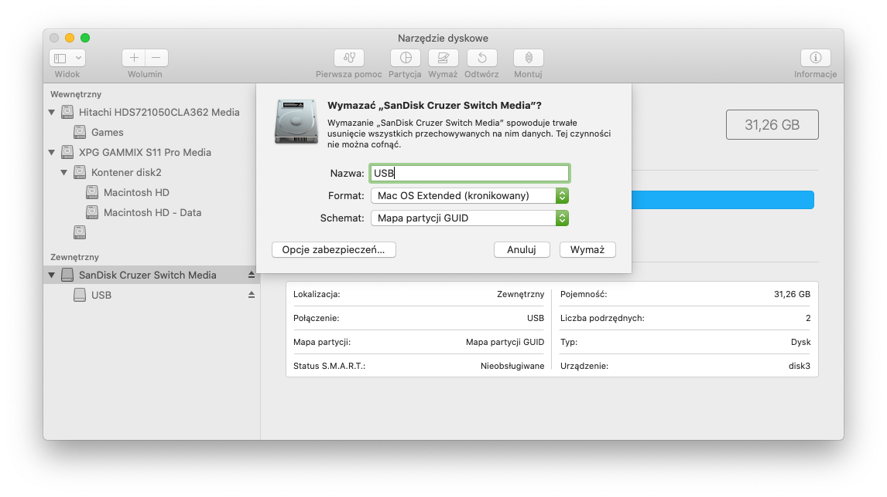

# Tworzenie nośnika instalacyjnego

### Wymagania 

Do stworzenia nośnika instalacyjnego z systemem MacOS Catalina i wyżej potrzebny jest pendrive lub dysk zewnętrzny o pojemności min. 16GB 

### Formatowanie Dysku

Uruchom `Narzędzia Dyskowe` 

* Kliknij Widok>Pokaż wszyskie urządzenia.
* Wybierz swój dysk docelowy i sformatuj go z następującymi ustawieniami:

### Kopiowanie instalatora
*Metoda przy użyciu narzędzia `createinstallmedia`*
 
 * Uruchom `Terminal` i wpisz poniższe polecenia w zależności od systemu który instalujesz :
 
### Catalina
`sudo /Applications/Install\ macOS\ Catalina.app/Contents/Resources/createinstallmedia --volume /Volumes/USB`

### Mojave 
`sudo /Applications/Install\ macOS\ Mojave.app/Contents/Resources/createinstallmedia --volume /Volumes/USB`

### High Sierra
`sudo /Applications/Install\ macOS\ High\ Sierra.app/Contents/Resources/createinstallmedia --volume /Volumes/USB`

Gratulacje, udało Ci się utworzyć nośnik instalacyjny, możesz przejść dalej do [Konfiguracja Bootloadera](/hackintoshpolska-docs/content/pl/docs/bootloader/_index.md)
