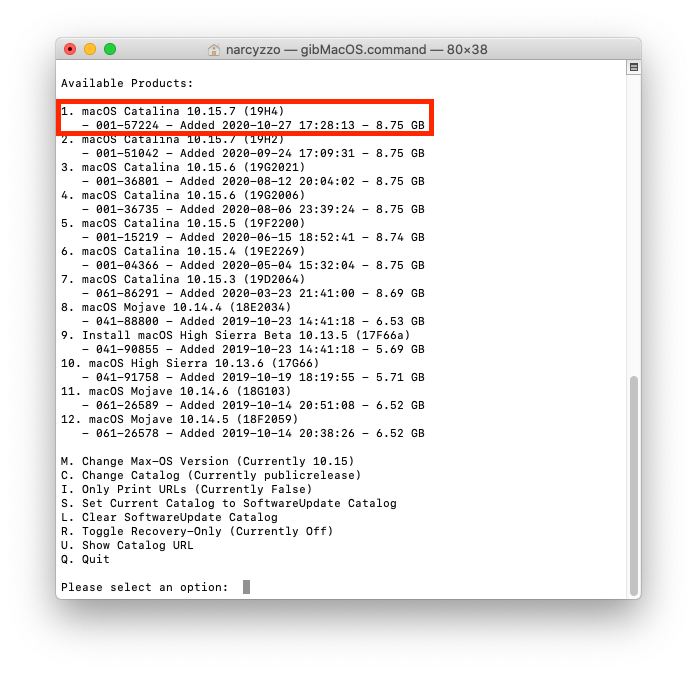
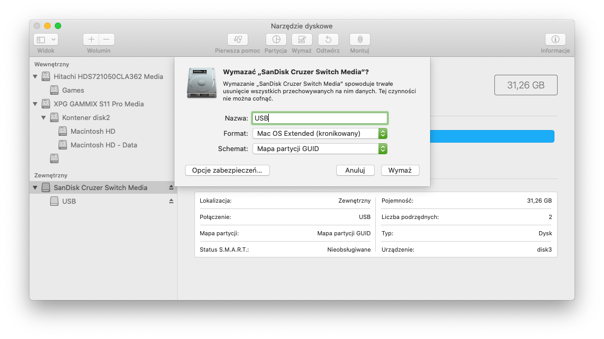

# Pobieranie instalatora z gibMacOS

* ####  *Narzędzie to pozwoli Ci pobrać kopię MacOS w wersji od 10.13.x do najnowszej* 

Jeśli jesteś na maszynie spełniającej wymagania systemu który chcesz pobrać, mozesz użyć App store do pobrania instalatora.

Pobierz narzedzie [gibMacOS](https://github.com/corpnewt/gibMacOS), nastepnie rozpakuj, przejdz do folderu i odpal `gibMacOS.command`:

Pojawią sie wersje MacOS z katalogu publicznego, jeśli chcesz pobrac wersje beta zmień katalog : `C.Change Catalog`

* Kopia instalatora bedzie pobrana do katalogu `gibMacOS-master/macOS Downloads`
* Aby przekonwertować pobrane pliki do `.app` i przenieść instalator do folderu /Applications uruchom `InstallESDDmg.pkg`

# Tworzenie nośnika instalacjnego

### Wymagania 

Do stworzenia nośnika instalacyjnego z systemem MacOS Catalina i wyżej potrzebny jest pendrive lub dysk zewnętrzny o pojemności min. 16GB 

### Formatowanie Dysku

Uruchom `Narzędzia Dyskowe` 

* Kliknij Widok>Pokaż wszyskie urządzenia.
* Wybierz swój dysk docelowy i sformatuj go z następującymi ustawieniami:

### Kopiowanie instalatora
*Metoda przy uzyciu narzedzia `createinstallmedia`*
 
 * Uruchom `Terminal` i wpisz poniższe polecenia w zależnosci od systemu który instalujesz :
 
### Catalina
`sudo /Applications/Install\ macOS\ Catalina.app/Contents/Resources/createinstallmedia --volume /Volumes/USB`

### Mojave 
`sudo /Applications/Install\ macOS\ Mojave.app/Contents/Resources/createinstallmedia --volume /Volumes/USB`

### High Sierra
`sudo /Applications/Install\ macOS\ High\ Sierra.app/Contents/Resources/createinstallmedia --volume /Volumes/USB`

Gratulacje, udało Ci sie utworzyc nośnik instalacyjny, możesz przejść dalej do [Konfiguracja Bootlaodera](/hackintoshpolska-docs/content/pl/docs/bootloader/_index.md)
